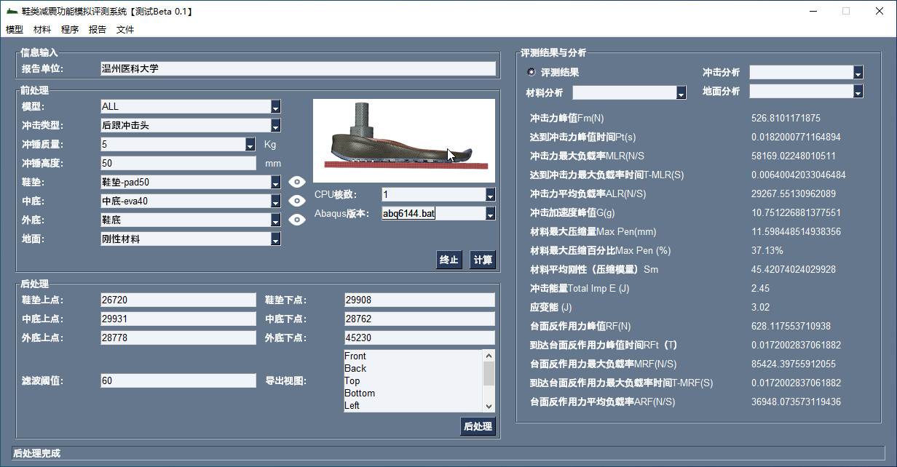
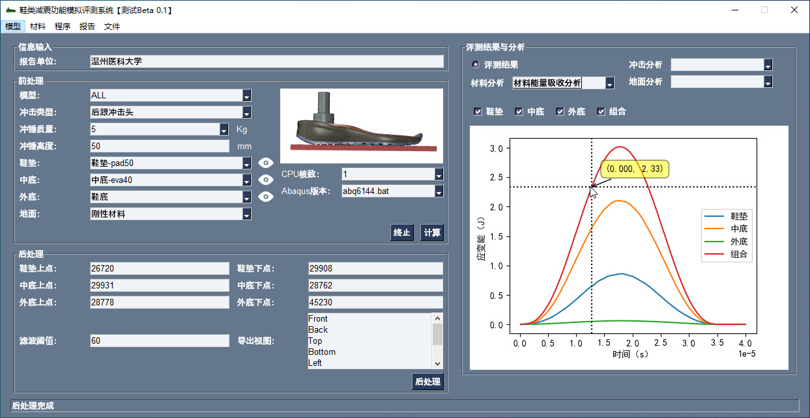
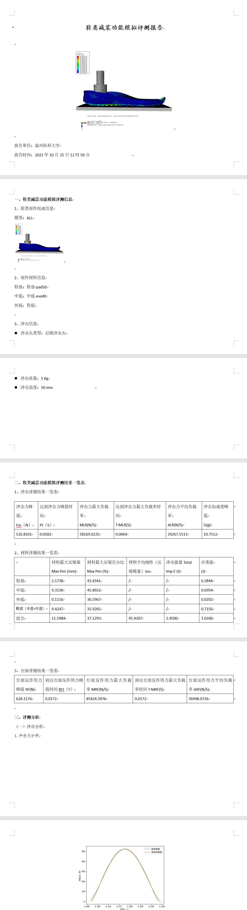

# The shoe shock absorption function simulation evaluation system 

Calculation of mechanical parameters of each component of shoes based on abaqus software

> The software was developed using python

